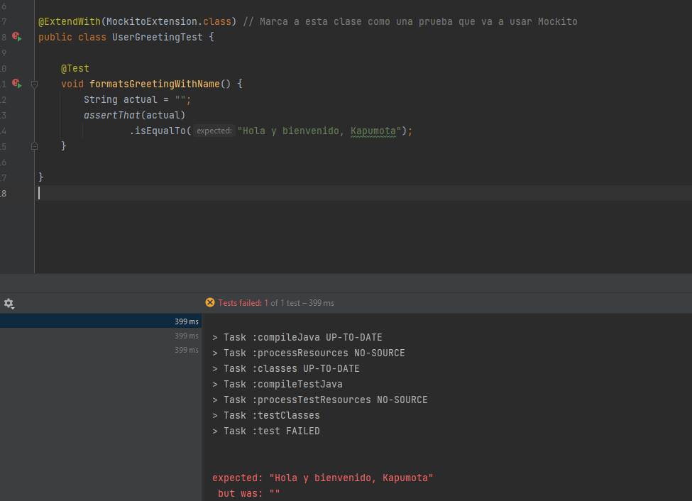
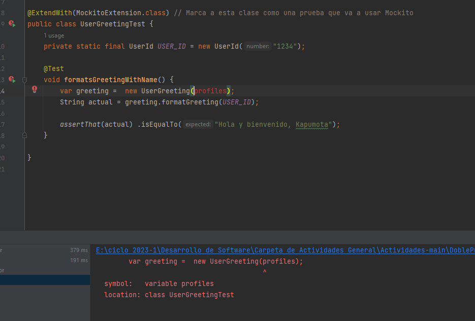
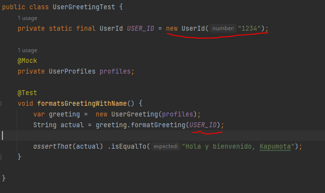
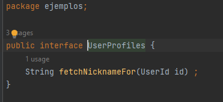
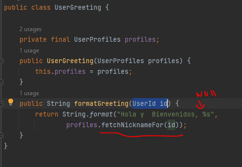

## Curso de desarrollo de software

Inicia un repositorio llamado CC-3S2 y dentro una carpeta llamada Actividades. Dentro de esta carpeta completa con código con Mockito la actividad  `DoblePruebas` y coloca todas tus respuestas.

Esta actividad es individual.

### Trabajando con Mockito


Mockito es una librería de código abierto gratuita que proporciona una amplia gama de funciones destinadas a crear dobles de prueba con muy poco código. 
El sitio web de Mockito se puede encontrar en https://site.mockito.org/. 

Para comenzar extraemos la librería Mockito y una librería de extensión en el  archivo Gradle. La librería de extensiones permite que Mockito se integre estrechamente con JUnit5. 

El extracto de build.gradle se ve así: 

```
dependencies {
	testImplementation 'org.junit.jupiter:junit-jupiter-
api:5.8.2'
	testRuntimeOnly 'org.junit.jupiter:junit-jupiter-
engine:5.8.2'
	testImplementation 'org.assertj:assertj-core:3.22.0'
	testImplementation 'org.mockito:mockito-core:4.8.0'
	testImplementation 'org.mockito:mockito-junit-
jupiter:4.8.0'
}

```

### Escribir un stub con Mockito

Veamos cómo Mockito nos ayuda a crear un objeto stub. Usaremos TDD para crear una clase `UserGreeting` que brinde un saludo personalizado, después de obtener el apodo de la interfaz `UserProfiles`. 

Escribamos esto usando pequeños pasos, para ver cómo TDD y Mockito funcionan juntos: 

1. Escribe la clase de prueba básica JUnit5 e intégrela con Mockito:

```
import org.junit.jupiter.api.extension.ExtendWith;
import org.mockito.junit.jupiter.MockitoExtension;

@ExtendWith(MockitoExtension.class)
    public class UserGreetingTest {
}
``` 
`@ExtendWith(MockitoExtension.class)` marca esta prueba como usando Mockito. Cuando ejecutamos esta prueba JUnit5, la anotación garantiza que se ejecute el código de la librería Mockito.

 2. Agrega una prueba que confirme el comportamiento esperado. Capturaremos esto en una aserción:

```
import org.junit.jupiter.api.Test;
import org.junit.jupiter.api.extension.ExtendWith;
import org.mockito.junit.jupiter.MockitoExtension;
import static org.assertj.core.api.Assertions.assertThat;
@ExtendWith(MockitoExtension.class)
public class UserGreetingTest {
	@Test
	void formatsGreetingWithName() {
    	String actual = «»;
    	assertThat(actual)
       	.isEqualTo("Hola y bienvenido, Kapumota");
	}
}
``` 
Este es el uso estándar de los frameworks JUnit y AssertJ como hemos visto antes. 

**Problema:** ¿Qué sucede si ejecutas la prueba ahora?. 

---
La prueba no pasa debido a que espera que salga el string : "Hola y bienvenido , Kapumota"
pero el String actual es "".

---

3. Elimina el SUT, la clase que queremos escribir, con un paso Act: 

```
import org.junit.jupiter.api.Test;
import org.junit.jupiter.api.extension.ExtendWith;
import org.mockito.junit.jupiter.MockitoExtension;

import static org.assertj.core.api.Assertions.assertThat;
@ExtendWith(MockitoExtension.class)
public class UserGreetingTest {
	private static final UserId USER_ID
    	= new UserId("1234");
	@Test
	void formatsGreetingWithName() {
    	var greeting = new UserGreeting();
    	String actual =
        	greeting.formatGreeting(USER_ID);
    	assertThat(actual)
        	.isEqualTo("Hola bienvenido, Kapumota");
	}
}

```

Este paso elimina las dos nuevas clases de código de producción, como se muestra en los siguientes pasos. 

4. Agrega un esqueleto de clase `UserGreeting`: 

```
public class UserGreeting {
	public String formatGreeting(UserId id) {
    	throw new UnsupportedOperationException();
	}
}

``` 
Como de costumbre, no agregamos código más allá de lo que se requiere para compilar la prueba. 
La decisión de diseño capturada aquí muestra que el comportamiento es proporcionado por un método `formatGreeting()`, que identifica a un usuario por una clase `UserId`. 

5. Agrega un esqueleto de ID de usuario de clase:

``` 
public class UserId {
	public UserId(String id) {
	}
}
```
**Problema:** ¿Qué sucede si ejecutas la prueba ahora?.  Explica la salida.

No pasa la prueba porque devuelve un UnsupportedOperationException 


6. Otra decisión de diseño a capturar es que la clase `UserGreeting` dependerá de una interfaz `UserProfiles`. 
Necesitamos crear un campo, crear el esqueleto de la interfaz e inyectar el campo en un nuevo constructor para el SUT

``` 
import org.junit.jupiter.api.Test;
import org.junit.jupiter.api.extension.ExtendWith;
import org.mockito.junit.jupiter.MockitoExtension;
import static org.assertj.core.api.Assertions.assertThat;
@ExtendWith(MockitoExtension.class)
public class UserGreetingTest {
	private static final UserId USER_ID
    	    = new UserId("1234");
             private UserProfiles profiles;
	@Test
	void formatsGreetingWithName() {
    	var greeting
        	       = new UserGreeting(profiles);
    	String actual =
        	         greeting.formatGreeting(USER_ID);
    	assertThat(actual)
        	         .isEqualTo(“Hola y bienvenido Kapumota”);
	}
}

```
Continuamos agregando el código mínimo para que la prueba se compile. 

**Problema:** ¿Qué sucede si ejecutas la prueba ahora?. Explica la salida.

"profile" no está definido por lo tanto es necesario crear o definir el objeto


7. Agrega comportamiento al método `formatGreeting()`: 

``` 
public class UserGreeting {
	private final UserProfiles profiles;
	public UserGreeting(UserProfiles profiles) {
    	this.profiles = profiles;
	}
 public String formatGreeting(UserId id) {
    	return String.format("Hola y  Bienvenidos, %s",
            	profiles.fetchNicknameFor(id));
	}
}
``` 

8. Agrega `fetchNicknameFor()` a la interfaz `UserProfiles`.

9. Ejecute la prueba. ¿Qué sucede?.

Sigue el mismo error es necesario definir a profile.

10. Agrega la anotación `@Mock` al campo `profiles`: 

```
import org.junit.jupiter.api.Test;
import org.junit.jupiter.api.extension.ExtendWith;
import org.mockito.Mock;
import org.mockito.junit.jupiter.MockitoExtension;
import static org.assertj.core.api.Assertions.assertThat;
@ExtendWith(MockitoExtension.class)
public class UserGreetingTest {
     private static final UserId USER_ID = new
        UserId("1234");

        @Mock
        private UserProfiles profiles;

         @Test
	void formatsGreetingWithName() {
    	    var greeting = new UserGreeting(profiles);
    	
               String actual =
           	         greeting.formatGreeting(USER_ID);
    	
               assertThat(actual)
            	.isEqualTo("Hola y bienvenido  Kapumota");
	}
}
``` 
**Problema:** ¿Qué sucede si ejecutas la prueba ahora?. Explica la salida.

Ahora como ya esta definido profile sucede que como no está definido la función fetch este retorna nulo.



Como no esta definido al funcion de la interfaz , cuando lo llamada retorna nulo



 11. Configura `@Mock` para devolver los datos del stub  correctos para la prueba.

``` 
import org.junit.jupiter.api.Test;
import org.junit.jupiter.api.extension.ExtendWith;
import org.mockito.Mock;

import org.mockito.Mockito;
import org.mockito.junit.jupiter.MockitoExtension;
import static org.assertj.core.api.Assertions.assertThat;
import static org.mockito.Mockito.*;
@ExtendWith(MockitoExtension.class)
public class UserGreetingTest {

     private static final UserId USER_ID = new
     UserId("1234");
	
      @Mock
       private UserProfiles profiles;
       
       @Test
	  void formatsGreetingWithName() {
    	      when(profiles.fetchNicknameFor(USER_ID))
       	               .thenReturn("Kapumota");
    	     var greeting = new UserGreeting(profiles);
    	     String actual =
           		greeting.formatGreeting(USER_ID);
    	assertThat(actual)
            	.isEqualTo("Hola y bienvenido, Kapumota");
	}
}

````
12. ¿Qué sucede si vuelves a ejecutar la prueba?. 

La prueba pasa con éxito!!


### Escribiendo un mock con Mockito

Mockito puede crear objetos mocks con la misma facilidad que los stubs. Todavía podemos usar la anotación `@Mock` en un campo que deseamos convertir en un mock, quizás dando sentido a la anotación. 
Usamos el método de `verify()` de Mockito para verificar que el SUT llamó a un método esperado en un colaborador. V

eamos cómo se usa un mock. Escribiremos una prueba para algún código SUT que esperamos enviar un correo electrónico a través de `MailServer`:

``` 
@ExtendWith(MockitoExtension.class)
class WelcomeEmailTest {
	@Mock
	private MailServer mailServer;
	@Test
	public void sendsWelcomeEmail() {
    	var notifications
             	= new UserNotifications( mailServer );
    	notifications.welcomeNewUser("test@example.com");
    	verify(mailServer).sendEmail("test@example.com",
            	"Bienvenido!",
	"Bienvenido a tu cuenta");
	}
}
``` 
En esta prueba, vemos la anotación `@ExtendWith(MockitoExtension.class)` para inicializar Mockito y el formato familiar `Arrange`, `Act` y `Assert` del método de prueba. 
La nueva idea aquí está en la aseveración. Usamos el método de `verify()` de la librería de Mockito para verificar que el SUT haya llamado correctamente al método `sendEmail()`. 
La comprobación también verifica que se haya llamado con los valores de parámetro correctos. 

Mockito utiliza la generación de código para lograr todo esto. Envuelve la interfaz que etiquetamos con la anotación `@Mock` e intercepta todas y cada una de las llamadas. 
Almacena valores de parámetros para cada llamada. Cuando llegamos a usar el método `verify()` para confirmar que el método se llamó correctamente, Mockito tiene todos los datos que necesita para hacerlo. 

#### Borrando la distinción entre stubs y mocks 

Una cosa a tener en cuenta sobre la terminología de Mockito es que difumina la distinción entre un stub y un objeto mock. 

En Mockito, creamos dobles de prueba que se etiquetan como objetos mocks. Pero en las pruebas, podemos usar estos dobles como un stub, un mock o incluso una mezcla de ambos. 

Configurar un doble de prueba para que sea tanto un stub como un mock es un olor a código de prueba. No está mal, pero vale la pena hacer una pausa para pensar. 

### Comparadores (matchers) de argumentos

Mockito proporciona métodos de librería llamados comparadores de argumentos. Estos son métodos estáticos que se usan dentro de las sentencias `when()` y `verify()`. 
Los comparadores de argumentos se utilizan para indicar a Mockito que responda a un rango de valores de parámetros, incluidos valores nulos y desconocidos, que podrían pasar a un método bajo prueba. 

La siguiente prueba utiliza un comparador de argumentos que acepta cualquier valor de `UserId`: 

```
import ejemplos.UserGreeting;
import ejemplos.UserId;
import ejemplos.UserProfiles;
import org.junit.jupiter.api.Test;
import org.junit.jupiter.api.extension.ExtendWith;
import org.mockito.Mock;
import org.mockito.junit.jupiter.MockitoExtension;
import static org.assertj.core.api.Assertions.assertThat;
import static org.mockito.ArgumentMatchers.any;
import static org.mockito.Mockito.when;
@ExtendWith(MockitoExtension.class)
public class UserGreetingTest {
      @Mock
      private UserProfiles profiles;
      
    @Test
       void formatsGreetingWithName() {
        when(profiles.fetchNicknameFor(any()))
             .thenReturn("Kapumota");
          var greeting = new UserGreeting(profiles);
    	String actual =
      	greeting.formatGreeting(new UserId(""));
    	assertThat(actual)
      	.isEqualTo("Hola y bienvenido, Kapumota");
	}
}
``` 
Agregamos un comparador de argumentos `any() al método `fetchNicknameFor()`. Esto le indica a Mockito que devuelva el valor esperado Kapumota sin importar qué valor de parámetro se pase a `fetchNicknameFor()`. 

Mockito ofrece una serie de comparadores de argumentos, descritos en la documentación oficial de Mockito. 

Estos comparadores de argumentos son especialmente útiles cuando se crea un stub para simular una condición de error. 

### Manejo del código de errores con pruebas 

A medida que creamos el código, debemos asegurarnos de que maneje bien las condiciones de error. Algunas condiciones de error son fáciles de probar. 

Un ejemplo podría ser un validador de entrada de usuario. Para probar que maneja el error causado por datos no válidos, simplemente escribimos una prueba que te proporciona datos no válidos 
y luego escribimos una aseveración para verificar que se informó con éxito que los datos no eran válidos. Pero, ¿qué pasa con el código que lo usa? 

Si el SUT es un código que responde a una condición de error planteada por uno de sus colaboradores, necesitamos probar esa respuesta de error.

Cómo lo probamos depende del mecanismo que elegimos para informar ese error. Es posible que estemos usando un código de estado simple, en cuyo caso, devolver ese código de error desde un 
código auxiliar funcionará muy bien. 

También es posible que hayamos elegido usar excepciones de Java para informar este error. Las excepciones son controvertidas. 
Si se usan incorrectamente, pueden conducir a un flujo de control muy poco claro en tu código. 
Sin embargo, necesitamos saber cómo probarlos, ya que aparecen en varias librerías de Java y estilos de codificación internos. 

Afortunadamente, no hay nada difícil en escribir la prueba para el código de manejo de excepciones.

Comenzamos con la creación de un stub, usando cualquiera de los enfoques cubiertos en esta actividad.
Luego, debemos hacer arreglos para que el stub arroje la excepción apropiada cuando llamamos a un método.

Mockito tiene una buena función para hacer esto, así que veamos un ejemplo de prueba de Mockito que usa excepciones:

``` 
@Test
	public void rejectsInvalidEmailRecipient() {
    	doThrow(new IllegalArgumentException())
        	.when(mailServer).sendEmail(any(),any(),any());
    	var notifications
        	= new UserNotifications( mailServer );
    	assertThatExceptionOfType(NotificationFailureException.
class)
            	.isThrownBy(()->notifications
.welcomeNewUser("not-an-email-address"));
	}
``` 
Al comienzo de esta prueba, usamos Mockito `doThrow()` para configurar el objeto mock. Esto configura el objeto mock de Mockito `mailServer` para lanzar `IllegalArgumentException` cada vez que
llamamos a `sendEmail()`, sin importar qué valores de parámetro enviemos. Esto refleja una decisión de diseño para hacer que `sendEmail()` arroje esa excepción como un mecanismo para informar 
que la dirección de correo electrónico no era válida. 

Cuando el SUT llama a `mailServer.sendEmail()`  ese método lanzará `IllegalArgumentExeption`.

Para este ejemplo, decidimos envolver el SUT y volver a generar `IllegalArgumentException`. Elegimos crear una nueva excepción relacionada con la responsabilidad de las notificaciones de los usuarios. 
Lo llamaremos `NotificationFailureException`. Luego, el paso de aserción de la prueba usa la característica de la librería AssertJ `assertThatExceptionOfType()`. 
Esto realiza los pasos `Act` y `Assert` juntos. 
Llamamos al método SUT `welcomeNewUser()` y aseveramos que arroja el error `NotificationFailureException`. 

Podemos ver cómo esto es suficiente para desencadenar la respuesta de manejo de excepciones en el código SUT. 

Esto significa que podemos escribir la prueba y luego eliminar el código requerido. El código que escribimos incluirá un controlador `catch` para `InvalidArgumentException`. 

En este caso, todo lo que tiene que hacer el nuevo código es lanzar un error de `NotificationFailureException`. Esta es una nueva clase que crearemos que extiende `RuntimeException`. 
Hacemos esto para informar que algo salió mal mediante el envío de una notificación. Como parte de las consideraciones normales de capas del sistema, queremos reemplazar la excepción original por una
más general, que se adapta mejor a esta capa de código. 


