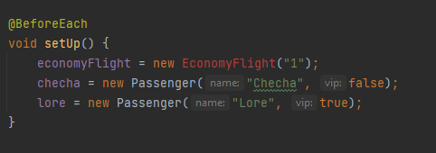
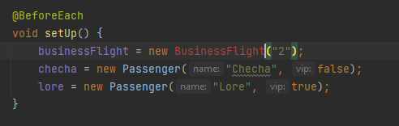
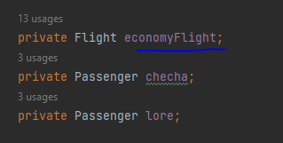
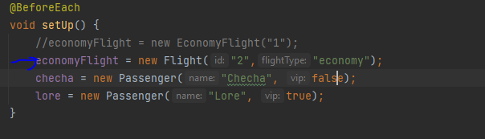
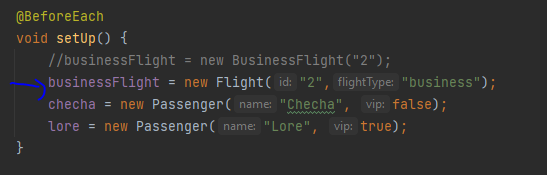
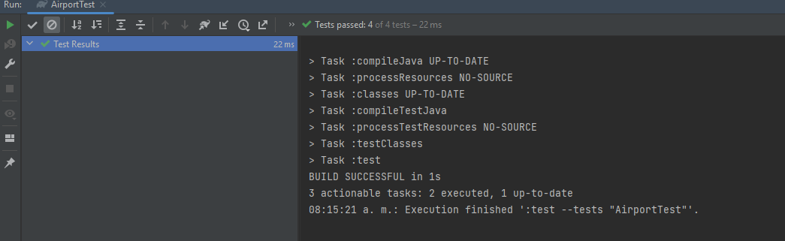
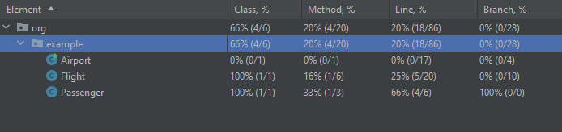

**Fase 1**

Para crear una aplicación confiable y poder comprender e implementar la lógica comercial de manera
fácil y segura, se considera cambiar la aplicación al enfoque TDD.

**Pregunta:**
Sigue la lógica comercial para un vuelo comercial y traduce eso escribiendo una prueba llamada
AirportTest. ¿Cuáles son los resultados de las pruebas con cobertura obtenidad?
¿Puedes indicar algunas conclusiones de lo anterior, necesitamos refactorizar?

**Respuesta**

Vemos que en un principio nos sale error Debido a que la clase EconomyFlight no esta creada

De la misma forma para la clase de BusinessFlight

Como en un principio se crea el objeto economyFlight como una instancia de la clase Flight y luego se procede
 a igualar a la instancia de otra clase entonces esto denota el uso de polimorfismo.

Entonces tomemos como cada una de las prueba que queremos hacer como vacias y en un principio
sin refactorizar solo instanciamos un objeto de tipo Flight de la siguiente manera.

Tanto para un vuelo de tipo economico como para un vuelo business

Vemos que todas las pruebas pasan.Al inicio sin definir aun las pruebas.

Obteniendo una cobertura de 0% inicial

