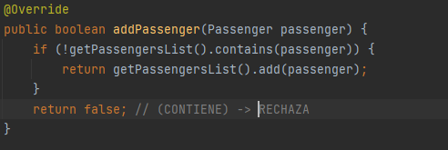
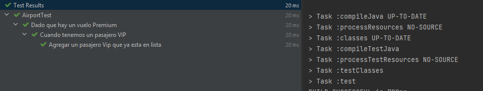

**FASE5-RESPUESTAS**

Como ha ocurrido un problema cuando un pasajero se ha agregado dos veces.
Necesitamos implementar o mejor dicho solucionar este error en el método de addPasenger.


- Característica a agregar:

```
Cada que se quiera añadir a algun pasajero que ya esta en lista. 
Se rechaza la solicitud.
```

---

Creamos nuestra prueba con estas caracteristicas. 
Esta prueba está en la clase: 
- class:`EconomyFlightTest` -> class :`RegularPassenger` .Es decir es una prueba para un tipo de vuelo
  `Economico` y un pasajero `Regular`.


**Ejecutamos la prueba:** Falla. Por lo tanto, falta implementar.


ANTES : 


DESPUÉS:



**Ejecutamos la prueba:** Pasa la prueba exitosamente.


---

Creamos nuestra prueba con estas caracteristicas. Ahora para cuando sea Vip , en Economico.
Esta prueba está en la clase:
- class:`EconomyFlightTest` -> class :`VipPassenger` .Es decir es una prueba para un tipo de vuelo
  `Economico` y un pasajero `Vip`.
Utilizamos a Lore porque es Vip y la agregamos dos veces :


**Ejecutamos la prueba:** Pasó. Por lo tanto, la implementación es suficiente. (La prueba esta demás)


---

**ANALOGO HACEMOS PARA LAS DEMÁS :** `BusinessFlightTest` y `PremiumFlightTest`


FALLA : 


Implementamos : Añadimos lo rojo


**Ejecutamos la prueba:** Y no pasa. Porque en realidad según las politicas anteriores
un pasajero en tipo de avion Negocios  no se puede añadir si no es Vip por lo tanto.
No peude haber repeticion de no Vips. Se descarta la prueba. 


Seguimos ahora para un Vip en Tipo de avion : Business.


**Ejecutamos la prueba:** Pasó por la implementación anterior. Si en caso lo hubiera descartado.
De primera instancia la prueba anterior. En esta de aquí tendríamos un Rojo - verde también.


---
Seguimos por último para la última clase : `PremiumFlightTest`

Creamos la prueba:


**Ejecutamos la prueba:**: No pasa .Necesita implementación.


Parecida a lo anterior: no es posible repetir dos pasajeros regulares porque por condición.
Solo se puede añadir si es Vip. Asi que nos ahorramos la implementacion para esta prueba y lo
ponemos como comentario.

Escribimos la prueba para cuando es Vip y de tipo Premium:


**Ejecutamos la prueba:**:Falla.

Implementamos:


**Ejecutamos la prueba:**:




**FINALMENTE VEAMOS LA COBERTURA:** Obtuvimos una 
cobertura del 100% porque abarcamos todos los escenarios
y rutas de ejecución posibles.


