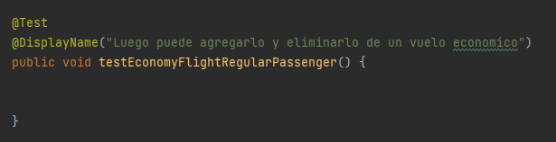
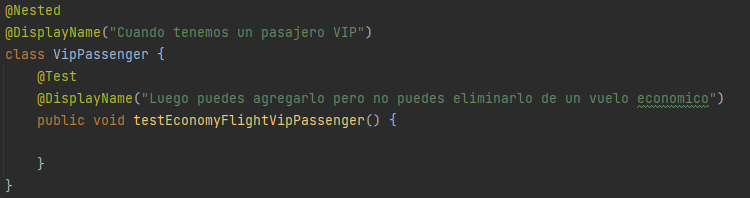
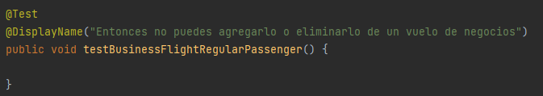
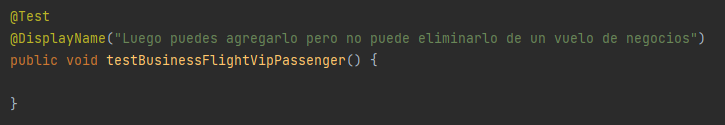
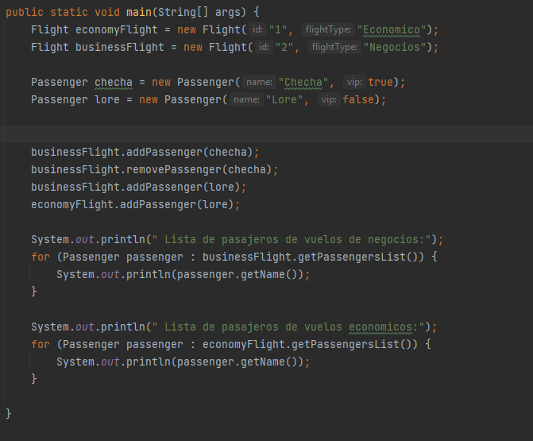
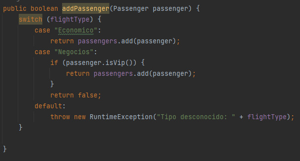
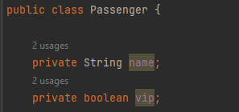
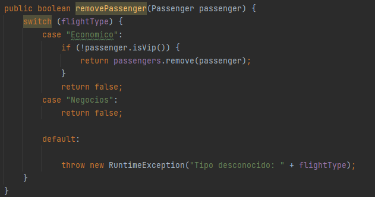
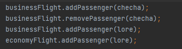
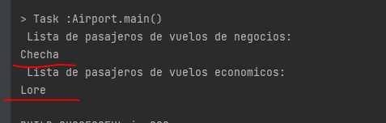

**ANTES**

```
En esta sección proponemos un inicio en el que no se defina aún las pruebas
```
---
**Cuando el tipo de vuelo es `Economico`:**

- Para una persona regular con la siguiente prueba:
  


- Para una persona vip con la siguiente prueba:
  


**Cuando el tipo de vuelo es `Negocios`:**

- Para una persona regular con la siguiente prueba:



- Para una persona vip con la siguiente prueba:



---

Comprendemos cada clase: `Flight` y `Passenger` . En la clase
principal.



Notamos que la función addPassenger de `Flight`.Solo agrega a la
lista de la siguiente forma :

- Si es `Economico` : Sin distinción lo agrega.
- Si es `Negocios` : Solo agrega si es vip



`Passenger` contiene 2 atributos, el nombre y su estado de Vip.




---
Notamos que la función removePassenger de `Flight`.

- Si es `Economico` : Lo elimina siempre y cuando no sea Vip.
- Si es `Negocios` : No elimina por ningun motivo, es mas devuelve falso.



---
Teniendo estas consideraciones en cuenta, en la funcion principal Airport cuando ejecutamos.
Creamos primero dos pasajeros:
- Checha : vip = true
- Lore : vip = false



1.- Cuando se llame a la función: `bussinessFlight.addPassenger(checha)` Como es `Negocios` y es Vip lo va agregar
a su lista porque es Vip.

2.- Cuando se llame a la función: `bussinessFlight.removePassenger(checha)` como es `Negocios` , no va eliminar y retorna `false`

3.- Cuando se llame a la función: `bussinessFlight.addPassenger(lore)` como es `Negocios` y no es vip. No la va a agregar.

4.- Cuando se llame a la función: `economyFlight.addPassenger(lore)` como es `Economico` va agregarlo a su lista.

Al ejecutar efectivamente vemos que tenemos dos listas con `Checha` y `Lore` en cada una de ellas.


