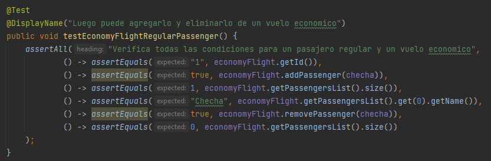

**FASE1 - RESPUESTAS**

Procedemos a completar cada una de las pruebas

**Cuando el tipo de vuelo es `Economico`:**

Se crean las siguientes instancias de `Flight` y `Passenger`

- Vuelo : id=`1` , tipo :  `Economico`
- Pasajero1 : name = `Checha` , vip = `false`
- Pasajero2 : name = `Lore` , vip = `true`

- Para una persona regular con la siguiente prueba:

Condiciones que verifica:

1. `() -> assertEquals("1", economyFlight.getId())` : Verifica que el id del tipo de vuelo sea 1.
2. `() -> assertEquals(true, economyFlight.addPassenger(checha))`: Verifica que se agrega al pasajero Checha. Siendo este no vip.
Pero como es `Económico` igual lo agrega sin distinción (Según lo analizado en la Fase: `Antes`).
3.  `() -> assertEquals(1, economyFlight.getPassengersList().size())`: Verifica que efectivamente el tamaño de la lista ahora es de un miembro.
4.  `() -> assertEquals("Checha", economyFlight.getPassengersList().get(0).getName())`: Verifica que el único pasajero de la lista tiene de nombre Checha.
5. `() -> assertEquals(true, economyFlight.removePassenger(checha))`: Verifica que la función removePassenger en el caso de tipo de vuelo `Economico` funciona correctamente
para el pasajero Checha. Debido a que **no** es `Vip` y lo tiene que eliminar, si se llama a esa función.
6. `() -> assertEquals(0, economyFlight.getPassengersList().size())`: Verifica que actualmente luego de haber eliminado al pasajero
Checha, entonces la lista tiene un tamaño de 0.

- Para una persona vip con la siguiente prueba:

- Pasajero 2 : name = `Lore` , vip = `true`

Condiciones que verifica:

1. `() -> assertEquals("1", economyFlight.getId())` : Verifica que el id del tipo de vuelo sea 1.
2. `() -> assertEquals(true, economyFlight.addPassenger(lore))`: Verifica que se agrega al pasajero Lore. Siendo este Vip.
   Pero como es `Económico` igual lo agrega sin distinción (Según lo analizado en la Fase: `Antes`).
3.  `() -> assertEquals(1, economyFlight.getPassengersList().size())`: Verifica que efectivamente el tamaño de la lista ahora es de un miembro.
4.  `() -> assertEquals("Lore", economyFlight.getPassengersList().get(0).getName())`: Verifica que el único pasajero de la lista tiene de nombre Lore.
5. `() -> assertEquals(false, economyFlight.removePassenger(lore))`: Verifica que la función removePassenger en el caso de tipo de vuelo `Economico` 
   no elimina a Lore, debido a que es `Vip` .Por lo tanto, retorna falso.
6. `() -> assertEquals(1, economyFlight.getPassengersList().size())`: Verifica que actualmente luego de no haberse eliminado al pasajero
   Lore, la lista tiene un tamaño de 1.

**Cuando el tipo de vuelo es `Negocios`:**

Se crean las siguientes instancias de `Flight` y `Passenger`

- Vuelo : id=`2` , tipo :  `Negocios`
- Pasajero1 : name = `Checha` , vip = `false`
- Pasajero2 : name = `Lore` , vip = `true`

- Para una persona regular con la siguiente prueba:

!

Condiciones que verifica:

1. `() -> assertEquals(false, businessFlight.addPassenger(checha))` : Verifica que devuelve falso al querer agregar al
pasajero Checha debido a que no es Vip.
2. `() -> assertEquals(0, businessFlight.getPassengersList().size())`: Verifica que la lista tiene tamaño 0, debido a
que no se agregó a Checha.(Lo discriminaron)
3.  `() -> assertEquals(false, businessFlight.removePassenger(checha))`: Verifica que al querer remover al pasajero Checha
, esto no es posible porque esta vacio y retorna falso. En realidad al ser de tipo Negocios siempre va a retornar `false` el remove.
Indistintamente de ser Vip o no. En otras palabras no necesariamente porque este vacio retornará `false`.
4.  `() -> assertEquals(0, businessFlight.getPassengersList().size())`: Verifica que la lista sigue teniendo tamaño 0.

- Para una persona vip con la siguiente prueba:

Pasajero2 : name = `Lore` , vip = `true`

Condiciones que verifica, Para la pasajera Lore:

1. `() -> assertEquals(true, businessFlight.addPassenger(lore))` : Verifica que devuelve `true` al querer agregar al
   pasajero Lore debido a que es Vip. Recordar: En vuelo tipo Negocio agrega solo si es Vip.
2. `() -> assertEquals(1, businessFlight.getPassengersList().size())`: Verifica que la lista tiene tamaño 1, debido a
   que se agregó a Lore.
3.  `() -> assertEquals(false, businessFlight.removePassenger(lore))`: Verifica que al querer remover al pasajero Lore
    , esto no es posible y retorna falso. En realidad al ser de tipo `Negocios` siempre va a retornar `false` el remove.
    Indistintamente de ser Vip o no.
4.  `() -> assertEquals(1, businessFlight.getPassengersList().size())`: Verifica que la lista sigue teniendo tamaño 1.

**EJECUTAMOS LAS PRUEBAS**

Las 4 pruebas pasan satisfactoriamente. Con una cobertura del 50% en la clase Flight.No se esta probando
cuando el tipo de vuelo es diferente de Economico o Negocios. Además es preferible
aplicar refactorización para eliminar la dependencia del atributo: `private String flightType;` 
y no estar evaluando en un switch cada caso.

Si quisieramos agregar un nuevo tipo de
vuelo por ejemplo tendriamos que modificar la clase Flight y esto no es recomendable.

