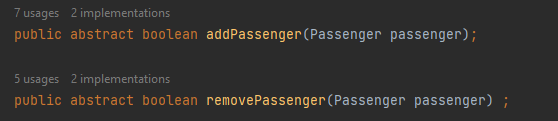

**FASE2-RESPUESTAS**

En esta fase vamos a **refactorizar** el código. Necesitamos crear clases hijas
que extiendan de Flight para que podamos utilizar el **polimorfismo** con estas clases. 
Y poder definir en cada una de estas clases su respectiva función: `addPassenger` y `removePassenger`

Cambiamos `addPassenger` y `removePassenger` como métodos abstractos de Light:

Modificamos el contructor elimiando el atributo: `flightType` que ya no es necesario.

Implementamos la clase EconomyFlight : 

De manera inicial ambos retornarian falso. Luego vamos a proceder a rescatar el analisis
realizado en la fase :`Antes`.

Implementamos la clase BusinessFlight :

Es notorio que si ejecutamos las pruebas no van a pasar debido a que no se ha implementado
la lógica de cada función en su respectivo tipo de vuelo. Por defecto todas retornan `false`.

---

**PROCEDEMOS A IMPLEMENTAR LA LÓGICA ANTERIOR**

Consideraciones para `addPasenger`:

- Si es `Economico` : Sin distinción lo agrega.
- Si es `Negocios` : Solo agrega si es vip

Consideraciones para `removePasenger`:

- Si es `Economico` : Lo elimina siempre y cuando no sea Vip.
- Si es `Negocios` : No elimina por ningun motivo, es mas devuelve falso.

---

Para la clase `EconomyFlight` : 

`addPasenger` : Sin distinción lo agrega

`removePasenger`: Lo elimina siempre y cuando no sea Vip.

!

---

Para la clase `BusinessFlight` : 

`addPasenger` : Solo agrega si es vip

`removePasenger`: No elimina por ningún motivo, es mas devuelve falso.

---

**PROCEDEMOS A EJECUTAR LAS PRUEBAS**

Efecetivamente todas las pruebas pasan:

Ahora veamos la cobertura :

La cobertura de código actual después de la refactorización es del 100% para las clases hijas. Esto significa que todas las líneas de código
están siendo ejecutadas y probadas por las pruebas unitarias. Pareciera que las pruebas se hubieran desplazado
hacia las clases hijas donde poseen cada una la implementación de la lógica y la clase base ya no contienen
las posibilidades debido a que solo es una clase abstracta y no contiene la lógica.

