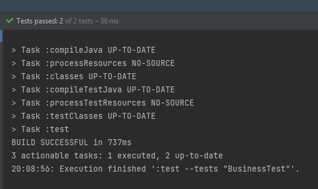

**FASE3-RESPUESTAS**

Vamos a implementar nuevas funciones requeridas por el cliente, este ha
ampliado las políticas de la aplicación.

**Características nuevas:**
- Nuevo tipo de vuelo: `Premium`.

Política para agregar Pasajero:

- Si pasajero es `Vip` -> agregarse al vuelo `Premium` 
,Caso Contrario ,se rechaza.

Política para eliminar Pasajero:

- Si se requiere, un pasajero puede ser eliminado de un vuelo.

---

Bueno según la fase 3 recién teníamos que implementar la notación
`@Nested` y proceder a ejecutar las pruebas.

Por ello para añadir algo en esta fase crearé una Clase `BusinessTest` y `EconomyTest` sin esta implementacion
de la notacion :  `@Nested`. Es asi como debimos haber empezado los test de manera normal.

Ambas pruebas pasan de la misma forma que cuando usamos la notación: `@Nested`. Solo que con las etiquetas
de lo que se está probando un poco más organizado.

