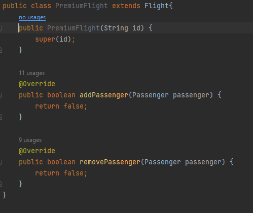
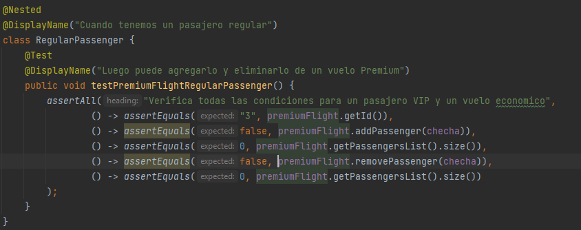
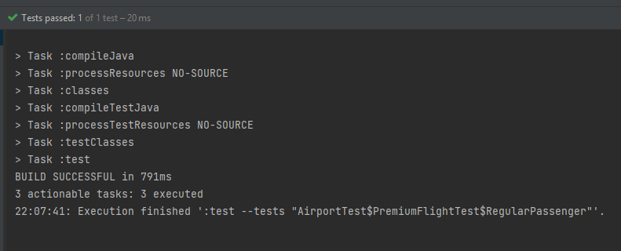
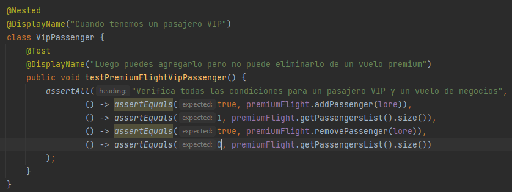
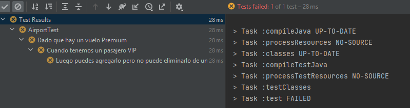
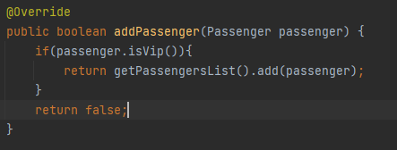
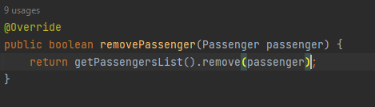
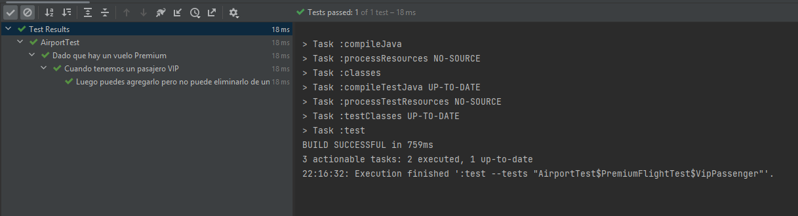
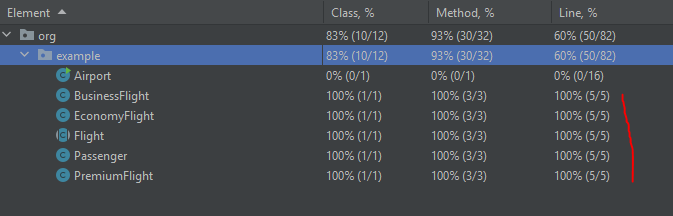

**FASE4-RESPUESTAS**

Realizaremos la implementación de la clase `PremiumFlight` y su lógica.

``` 
Debemos crear PremiumFlight como una subclase de Flight

``` 
En primera instancia definimos las funciones que retornen `false`.Para
luego ir implementando la lógica.



Procedemos a analizar la lógica según:

- Se agrega un pasajero a un vuelo premium, solo si es pasajeros VIP
- Cualquier tipo de pasajero puede ser eliminado de un vuelo premium.

---

Creamos la prueba para `PremiumFlightRegular`:
Considerando las políticas para este tipo de vuelo. Como
`Checha` no es Vip no debería agregarse y la lista deberia seguir
con tamaño 0. Luego al querer remover deberia dar false
porque no hay ningún elemento `Checha`. Por esto definimos la 
siguiente prueba:




Ejecutamos la prueba: y la prueba pasa por más que no hallamos 
implementado su lógica. Es decir su lógica comercial existe es
suficiente.



---

Luego creamos la prueba para `PremiumFlightVip`:
Considerando las políticas para este tipo de vuelo. Como lore es
vip entonces debe poder agregarse a la lista y también poder 
removerse. La prueba quedaría asi:



Ejecutamos la prueba:Efectivamente no pasa porque aun esta por defecto
que retorne falso. Falta la implementación.



usando TDD implementamos:


Consideraciones para `addPasenger`:

- Se agrega un pasajero a un vuelo premium, solo si es pasajeros VIP



Consideraciones para `removePasenger`:

- Cualquier tipo de pasajero puede ser eliminado de un vuelo premium.




Ejecutamos las pruebas: Pasan exitosamente.



Obtenemos una cobertura del 100%: Obviamente dejando al lado el main
que solo fue para el análisis de la lógica inicial.

