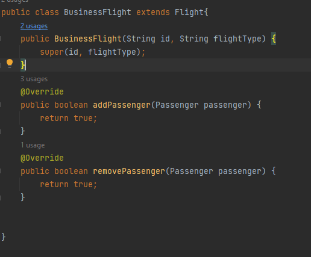
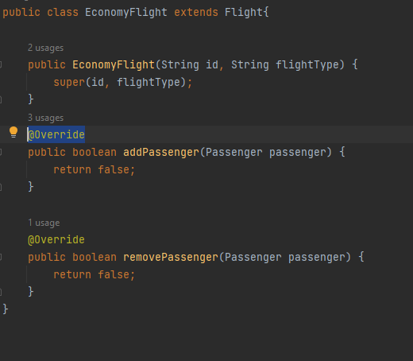

**Fase 2**

La clave para la refactorización es mover el diseño para usar polimorfismo en lugar de código
condicional de estilo procedimental. Con el polimorfismo el método al que está llamando no se
determina en tiempo de compilación, sino en tiempo de ejecución, según el tipo de objeto efectivo.
Para el ejercicio tratamos la refactorización de la aplicación de gestión de vuelos reemplazando el
condicional con polimorfismo: se elimina el campo flightType y se introduce una jerarquía de clases.
El principio en acción aquí se llama principio abierto/cerrado. 

**Respuestas**
Nos sugiere entonces quitar el atributo de String
`flightType` de la clase Flight.

Definimos nuestras clases que extienden a Flight

Procedemos a eliminar el campo `flightType` , por lo tanto cambiamos el contructor y eliminamos el
getter que tenia tambien. 
