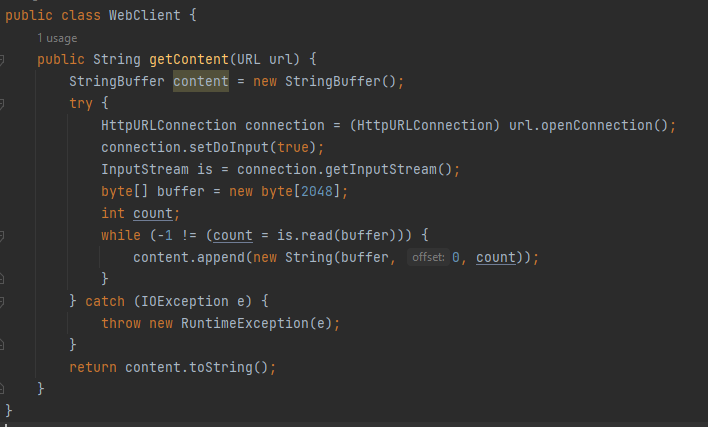
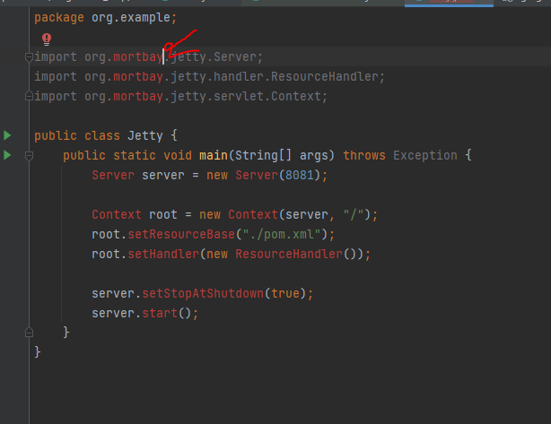

**Pregunta 2 Stubs ( 5 puntos)**

- El objetivo de los ingenieros de esta empresa es realizar una `prueba 
unitaria` del método `getContent` mediante el uso de **stubs** del recurso 
web remoto.

**INCONVENIENTE:** El recurso web remoto aún no está disponible y los 
ingenieros deben avanzar con su parte del trabajo en ausencia de ese recurso.

Nos piden revisar la clase `WebClient.java`

Vemos que la clase consta de una función llamada `getContent `que retorna,
haciendo una serie de transformaciones ,el contenido de una URL en String.

**Sugerencia:** instalar un servidor de prueba `Apache.`

---

**Pregunta**
Utiliza el código Jetty.java y realiza experimentos de cómo iniciar desde Java y cómo definir una raíz 
de documento (/) desde la cual comenzar a servir archivos. 

Me salió este error en las librerías y no se ha podido descargar en la web el JAR.
Lo estube intentando todo el dia y no encuentro solución. Al comienso lo cree en gradle y luego en maven
cambie el pom.xml